<a href="https://github.com/Farhan7-tech/ChallengeApp-Frontend"></a>

## About

ChallengeApp is a small full-stack project: a **Spring Boot REST API** on the backend and this **React + Vite** app on the front. You add a challenge for a month, for example *"January: run 100 km"*, and see all your monthly challenges in a list.

## Features

- ➕ **Add a challenge:** a form with month and description, both required
- 📋 **See all challenges:** loaded from the API when the page opens
- 🔄 **Instant refresh:** the list reloads as soon as a new challenge is saved
- 🎨 **Clean UI:** Bootstrap 5 cards and list groups

## Tech stack

| Layer | Tools |
| --- | --- |
| UI | React 19, Bootstrap 5, React Bootstrap |
| HTTP | Axios |
| Build | Vite 6 |
| Code quality | ESLint 9 (react, hooks, refresh plugins) |
| Backend | Spring Boot REST API on `localhost:8080` |

## API used

| Method | Endpoint | Purpose |
| --- | --- | --- |
| `GET` | `/challenges` | Get all challenges |
| `POST` | `/challenges` | Create a challenge: `{ "month": "January", "description": "..." }` |

## Getting started

**Requirements:** Node.js 18+ and the ChallengeApp Spring Boot backend running on port `8080`.

```bash
git clone https://github.com/Farhan7-tech/ChallengeApp-Frontend.git
cd ChallengeApp-Frontend
npm install
npm run dev
```

Open the URL Vite prints, usually http://localhost:5173.

| Script | What it does |
| --- | --- |
| `npm run dev` | Start the dev server with hot reload |
| `npm run build` | Production build into `dist/` |
| `npm run preview` | Preview the production build |
| `npm run lint` | Run ESLint |

## Project structure

```
src/
├── App.jsx                     # Loads challenges and lays out the page
├── main.jsx                    # React entry point
└── components/
    ├── AddChallenge.jsx        # Form that creates a challenge
    ├── challengeList.jsx       # Renders the list
    └── challenge.jsx           # A single challenge item
```

<br>

<a href="https://github.com/Farhan7-tech"></a>
